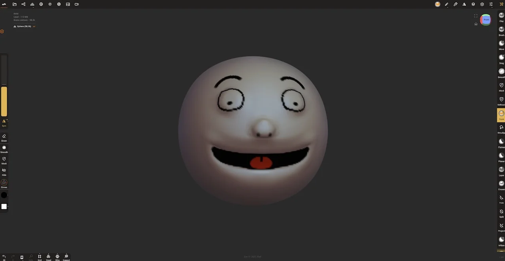
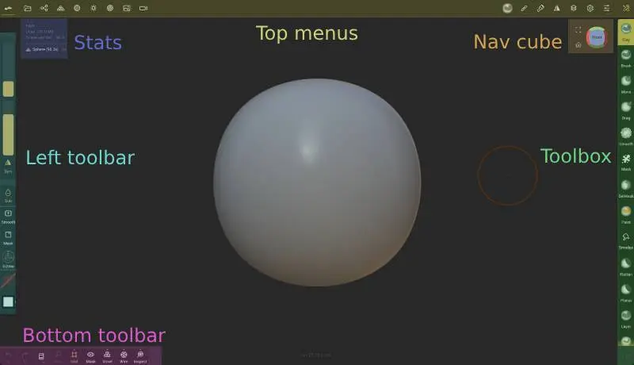

# Getting Started

## Welcome to Nomad!

Nomad is a 3d sculpting app that works on many devices, and works best on tablets with a pressure sensitive stylus, eg an Apple iPad and pencil, or a Samsung Galaxy Tab with stylus.

It is inspired by desktop sculpting apps like Zbrush and Blender, with a focus on an easy to understand UI, without sacrificing on features. If you've used 3d sculpting apps before, Nomad will feel very familiar.

If this is your first time doing 3d sculpting, then it's good to know some basics.

::: tip Prefer video?
Youtube now has a LOT of beginner video tutorials, here are some great links:

* [Nomad Sculpt Crash Course by Dave Reed](https://www.youtube.com/watch?v=42Qak3b0bPE)
* [Nomad Sculpt Beginner tutorial by Small Robot Studio](https://www.youtube.com/watch?v=7lQgnr4OnK0)
* [NOMAD FOR BEGINNERS series by SouthernGFX](https://www.youtube.com/watch?v=4eraz4IQwwc&list=PLMiwb2mOovgyBFWHiHHZNbTZtjn5HapuZ)
:::

## Your first sculpt

When you first start Nomad you'll see a sphere on screen. Simply drag your stylus on the sphere to start sculpting. Symmetry is enabled by default to make sculpting easier.

To make the brush bigger or smaller, use the radius slider on the left.

To make the brush stronger or weaker, use the intensity slider on the left.

The default tool is the `Clay tool`, and it adds to the surface. To subtract from the surface, tap the `Sub` button on the left. To add to the surface, tap the Sub button again.

To smooth the surface, tap the `Smooth` button. To go back to regular sculpting, tap the Smooth button again.

To rotate around the model, drag in empty space outside the model.

To zoom, use the two finger zoom/pinch gesture.

To pan the camera, press 2 fingers on the screen and drag.

If you make a mistake, a 2 finger tap will undo, or use the undo button in the lower left. 

## Add color

Nomad allows you to paint the surface of your sculpt. From the tool menu on the right, find the `Paint` tool, and click it. On the left toolbar a colored sphere will appear. Click it, this will bring up a color selector. Choose a color, and paint on your model.

To erase, tap the `Erase` button on the left toolbar, then erase on the surface. Tap the erase button again to get back into paint mode.

Using the clay brush in add/sub modes, smooth, paint, see if you can make a simple cartoon head:

## Other tools

The tool pallette has many tools to help with sculpting. So far you've used the clay brush (the default starting tool), smooth, and paint. Because smooth is used frequently, it has an extra shortcut in the left hand toolbar.

The tools in Nomad can do a wide variety of things, from sculpting related tools like move, crease, inflate, to tools like split and trim that are more like carpentry or metalwork tools. The [Tools](tools.md) page has more info.

See if you can use the move, crease, inflate, and smooth tools to add more detail to your head, change its shape:

Now that you know the basics of Nomad, lets look at the rest of the interface.

## Interface

* `Top menus` - The menus to access most of Nomads features. The top-left menus mainly cover scene and object features, the top-right menus are related to tools. On smaller screens these menus will collapse together to save space.
* `Stats` - Information about the scene, the current object, mask status, memory usage.
* `Nav Cube` - A helper to show what side of the sculpt you're looking at, as well as a shortcut to jump to different views. Tapping the cube will jump the view to the tapped side. Dragging the cube will rotate. Tap the small icons to the side of the cube to frame the current object, or reset to the default home view.
* `Toolbox` - Nomad's tools are available from this scrollable region.
* `Left toolbar` - Sliders for radius and intensity for most tools, context specific buttons for other tools, and shortcuts for symmetry, the tool alt/sub mode, masking, smoothing, the gizmo, and paint options.
* `Bottom toolbar` - Shortcuts for commonly used features, explained below.

::: tip Left handed?
You can mirror the placement and ordering of all the toolbars, see [Mirror top bar](interface.md#mirror-top-bar) and other related options.
:::

## Bottom toolbar

* `Undo` - revert the last operation
* `Redo` - restore the last undo operation
* `History` - acccess history options, explained in the [History](history.md) menu.
* `Solo` - Toggle showing only the current object, or all objects
* `X-Ray` - Make all other objects render in x-ray mode, and the current object solid. A long press or swipe up will allow you to set the colour and opacity of the x-ray mode.
* `Voxel` - A shortcut for the [Voxel Remesher](topology.md#voxel-remesher) voxel remesh button. A long press or swipe up will reveal shortcuts to set voxel remesh quality.
* `Grid` - Toggle displaying the grid. A long press or swipe up will reveal options for the grid.
* `Wire` - Toggle a wireframe overlay. A long press or swipe up will reveal options for the wireframe.
* `Inspect` - Toggle viewing extra data about the current mesh. By default it will display UVs, but a long press or swipe up will allow you to inspect other properties if they exist, and if this is displayed in the background or on the mesh.

## Next steps

What you should learn next is up to you, and what you find interesting! Here's some suggestions:

Want to learn more about the sculpting tools? Head to the [Tools](tools.md) section.

Want to export your models? Or import models to sculpt on? Or create images of your sculpts? Head to the [Files](files.md) section.

Do you want to learn more about controlling detail on your sculpt? Head to the [Topology](topology.md) section and learn about multires and decimation.

Do you want to work with more objects? Combine simple objects and primitives into a bigger scene? Head to the [Scene](scene.md) section.

Do you want to want to learn *everything* about Nomad? Good choice! This manual covers all of Nomad, includes lots of tips and tricks, and has a great search function at the top. Use the navigation on the left to learn more.

If you prefer video, Holger Schönischka has made a huge collection of tips and tricks for Nomad on Youtube: https://www.youtube.com/@ProcreateFX/videos

## Getting help

If you still have questions after reading the manual and watching the tutorial videos, there's three main ways to talk to other Nomad users or the developer of Nomad:

* Visit the forums: [forum.nomadsculpt.com](http://forum.nomadsculpt.com)
* Join the Nomad discord chat: [https://discord.com/invite/8h7BwpRz29](https://discord.com/invite/8h7BwpRz29)
* Contact the developer directly at support@nomadsculpt.com

