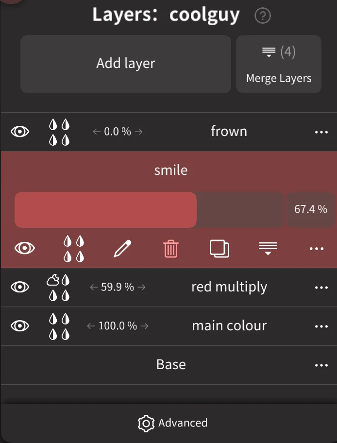
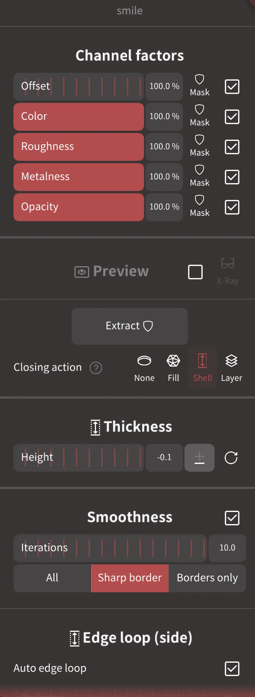
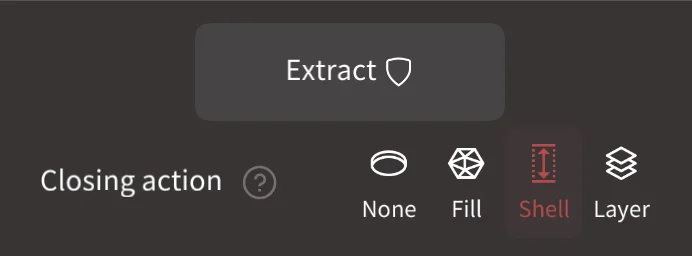
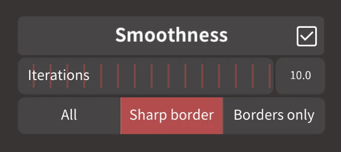
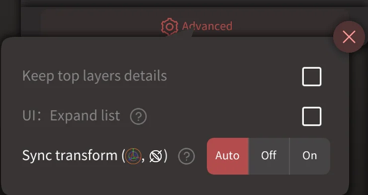
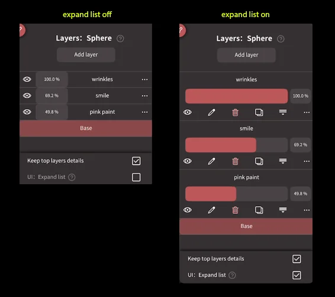

#  Layers 

This menu contains the layer stack, a way to store edits to your object in a non destructive way, and many ways to combine and repurpose layers.

 

## Overview

Nomad layers serve multiple purposes.

Paint information (Color, Roughness, Metalness, Opacity) work with layers similar to 2d paint applications. A layer can be created and paint applied to a model. The layer can be toggled on or off, have its opacity adjusted, the layer can be duplicated, its order can be changed in the layer stack, its blending mode adjusted.

Nomad also users layers for sculpting. A layer can store fine details like wrinkles, or it can store large changes, allowing them to function like blendshapes/shape keys/morph targets in other 3d applications. For example you could sculpt different facial expressions on different layers, and adjust the layer sliders to combine them into new expressions.

In this case the changes stored in a layer are purely additive, layer order doesn't matter like it does for paint.

Layers can be partially erased via the [Delete Layer](tools.md#delete-layer) tool, and layers can also be used to create masks based on the different information stored in the layer.

::: tip
Unlike most sculpting software, changing the topology of a mesh will not discard the layers. You can use the [Voxel Remesher](topology.md#voxel-remesher), the [Multiresolution](topology.md#multiresolution) or the [Trim](tools.md#trim)/[Split](tools.md#split) tools, but note that when using [Voxel Remesher](topology.md#voxel-remesher), the quality of the layer will be impacted.
:::

----

## Layer menu 

Press `Add layer` to create a new layer.

Each layer has a name, a slider to control it's strength/factor, and option buttons.

### Options

| Action       | Icon                         | Description                                         |
| :----------: | :--------------------------: | :-------------------------------------------------  |
| Visible      |    | Show/hide the layer                                 |
| Blend Mode   |     | The photoshop style blending mode. The 4 icons display the modes for Color, Roughness, Metalness, Opacity.                                 |
| Edit Name    |      | Edit the layer name                                 |
| Delete       |       | Delete the layer                                    |
| Duplicate    |       | Duplicate the layer                                 |
| Merge Down   |  | Merge the layer with the lower layer (or base mesh) |
| More         |        | [More...](#more) options                            |

To move a layer to another part of the layer stack, press and hold on its name, then drag.

### More...

The 'More...' button will show extra options for the current layer:

 

#### Channel factors

These controls let you scale the amount of sculpt/color/roughness/metalness/opacity for the layer. These values are multiplied against the layer factor slider, so for example if the layer strength is 1, but the color channel factor is 0.5, then the color displayed will be at 0.5 strength.

`Offset` controls the layer sculpt strength. While color/roughness/metalness are clamped between 0 and 1, offset can be any value, both positive and negative. 

::: tip
Offset can be used to turn a layer of bumps into a layer of cavities, or a smile into a frown:

A symmetrical layer can be cloned and then split into left/right shapes with del layer:

Layers with negative offset factors can be baked down to empty layers to make new positive shapes.

Layers with positive offset factors above 1 can be used to experiment with more extreme blendshapes.
:::

::: warning
At the moment layers only share a single opacity channel for all 3 channels (color/metalness/roughness).
If you merge multiple layers with per-channel intensity that aren't at full intensity, it's possible that the final result will look different.

Maybe in the future, each channel will have its own alpha channel to remove this limitation.
:::

####  Mask
The mask button next to each slider will create a mask from that channel. Similar to using layers to make selections in painting applications, this allows you to reuse work you have done in a layer for other operations.

####  Preview
 

When enabled, will preview the extract settings for this layer (see the next section).

When xray is enabled, only the exacted shape will be solid, the rest of the shape will be made transparent, useful if you are using negative extraction heights.

#### Extract
 

The `Extract` button will duplicate the contents of the layer into a new object, usually with a user specifed thickness set by the next section.

`Closing action` determines how the duplication is done:

* None - Simply extract the part, do not try to generate sides or fill any holes.
* Fill - Hole is filled and smoothed with triangles. Do not use this option for flat surfaces.
* Shell - Close the extracted shape with the thickness value and direction options.
* Layer - Extract the layer difference.

####  Thickness
 

The depth of the shell extrusion. Positive values grow out of the surface, negative values grow into the surface.

The plus/minus next to this value will set the direction of the extrusion:
* Minus ( - ) will start from the current surface and extrude down. 
* Plus ( + ) will start from the current surface and extrude up.
* PlusMinus ( ± ) will push the top and bottom of the extrusion away by equal amounts, so it will be halfway embedded in the original surface.

#### Smoothness
 

If the edges of the region to be extracted are jagged, this slider will attempt to blur the edge into a smoother shape. 

####  Edge loop (side)
 

This section is visible when the closing action is 'Shell'. 

`Auto Edge-loop (side)` will calculate the number of edge loops along the shell sides to create square polygons. 

If disabled, the `Division` slider will set the number of divisions on the sides.

_This is the end of the 'More...' submenu._

### Advanced

#### Keep top layers details

Ensure that small details on higher layers remain visible when large changes are made to lower changes.

By default if you sculpt small wrinkles on a layer, then go and make large changes to the base layer, the wrinkles will be lost. Enabling this toggle will allow those small details to always float above the lower large changes. In the following video, see how the wrinkle detail gets removed by default, but remains visible when 'keep top layers details' is enabled:

#### UI: Expand list

The default layer menu lets you toggle layer visibility and the layer opacity. Enabling this option expands the full controls for every layer.

#### Sync transform

If enabled, all the unselected layers will be adjusted depending on the transform rotation, scale, skew. 

Disbale this option if the other layers are meantt o be used without the new transform that you are applying.

When set on `Auto`, only the visible layers will be adjusted.