#  Post process 

This menu controls many aspects of Nomad to affect the look of the render.

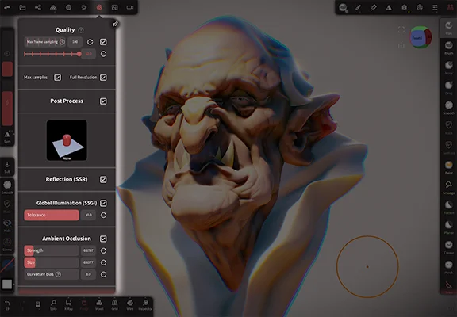

Using post processing can substantially change the final look of your scene.

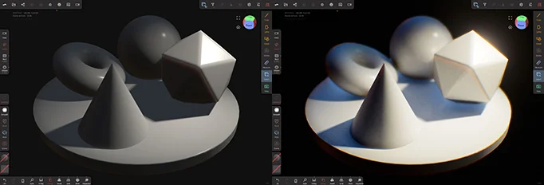
*The same scene before and after post processing, no additional lights or material changes.*

Post process can impact the performance by a lot depending on your device.
There's a global checkbox to disable all the postprocess, so that you can quickly go back to sculpting/modeling without losing your presets.
For PBR rendering, [Ambient Occlusion](#ambient-occlusion-ssao), [Reflection](#reflection-ssr) and [Tone Mapping](#tone-mapping) should be enabled.

However, most of the time you want the post process to be disabled when you are sculpting, to focus on the shape itself of the rendering.

## Quality

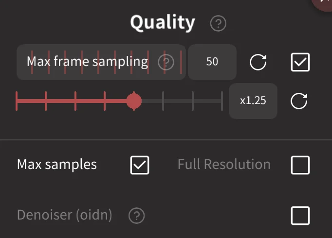
### Max frame sampling
Nomad will calculate a certain amount of post processing for a single frame render, which can look noisy. This control determines how many frames will be rendered, then blended together to remove most noisy artifacts. Some effects require no extra samples (eg color grading), while others like global illumination can require hundreds of samples to be noise free. 

In the viewport this can be seen whenever nomad is left alone, the image quality will gradually refine up to the max samples, then stop. This number of calculations is also used in the render section of the [Files menu](files) when 'export png' is clicked.

### Resolution multiplier
This slider controls the resolution of the post processing. A value of x1.0 will mean the render's are done at the pixel resolution of the device. A value of x0.5 will render at half resolution, which will be fast but low quality. A value greater than 1 will render at a bigger size, then scale down. This result in higher quality, less noise, but longer render times.

### Max samples

This will increase the quality of post process, but generally `Full resolution` will have more impact. 

### Full resolution
When enabled will force the resolution multiplier to x1.0

### Denoiser (oidn)

Apply a denoiser to the image. This can allow you to use much lower samples. This only works if `Full Resolution` is enabled. Note that the denoising happens after all the samples have been calculated, and can be processor intensive.

## Preset browser
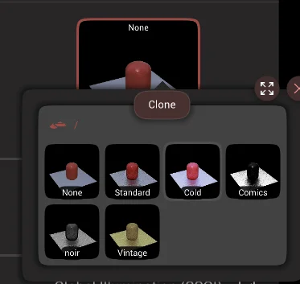
Clcking on the image will display a collection of post processing presets. To define your own presets, select one, click 'clone', make changes. To save, click the preset image, click again inside the preset browser, and choose 'save'.

## Reflection (SSR)
With this option, objects can reflect other objects in the scene, as long as the objects are visible on the screen.
If you have metallic and shiny objects in your scene, then this option should probably be used.
This option is only effective with PBR mode.

| SSR off                    | SSR on                    |
| :------------------------: | :-----------------------: |
|  | 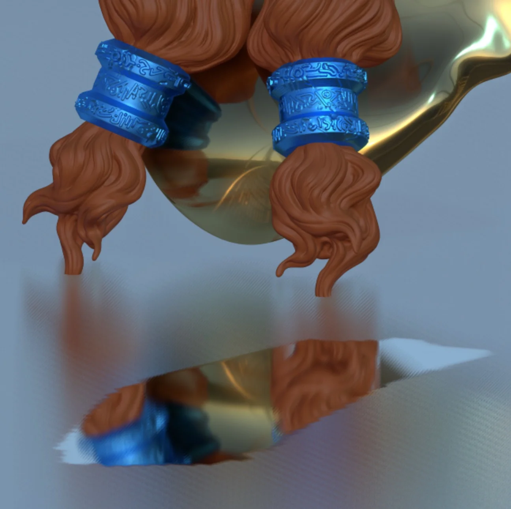 |

## Global Illumination (SSGI)

Global illumination simulates how light bounces between surfaces, eg a red wall will cast red onto a nearby white object. This can hugely enhance the realism of a render when used with ambient occlusion and reflections. 

`Strength` - The intensity of the global illumination. 

| SSGI off                   | SSGI on                   |
| :------------------------: | :-----------------------: |
|  |  |

_A spotlight is behind the sphere, aimed at the ceiling. With SSGI off, only the ceiling is lit. WIth SSGI on, light bounces from the ceiling to the walls to the sphere._

## Ambient Occlusion (SSAO)
Ambient occlusion will darken areas where the light has less chance of reaching (corners, etc).
The effect only depends on the model geometry.

* `Strength`- Intensity of the effect.
* `Size`- How widespread the effect is.
* `Curvature bias` - How sensitive the effect is relative to the surface variation.
* `Color` - A tint multiplied into the occlusion, used for creative effects.

| SSAO off                    | SSAO on                    |
| :-------------------------: | :------------------------: |
| 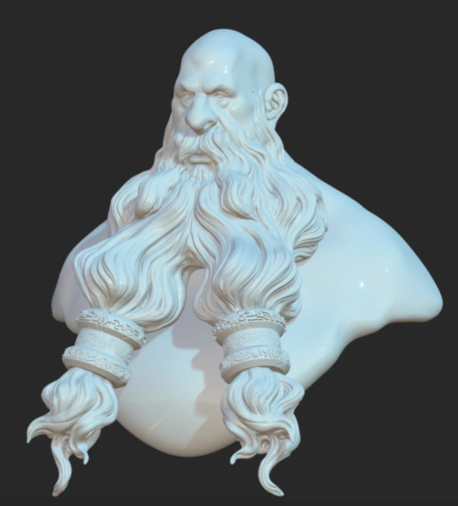 |  |

::: tip
AO will be most visible in areas lit mainly by environment light. Areas that are under strong direct light will receive a much weaker AO effect.

:::

## Depth of Field (DOF)
Add a blur effect on the region that is outside the focus.

Simply tap on your model to change the focus point.

* `Far blur` - The amount of blurring to be applied on the far side of the focus point.
* `Near blur` - The amount of blurring to be applied between the focus point and the camera.

| DOF off                   | DOF focus on far ring       | DOF focus on close ring    |
| :-----------------------: | :-------------------------: | :------------------------: |
|  | 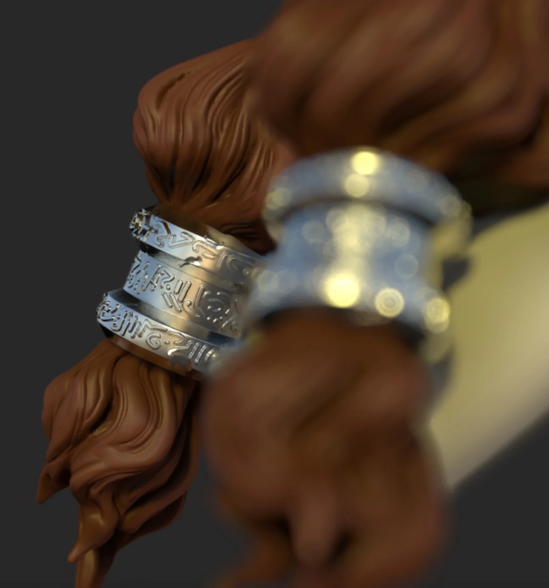 |  |

## Bloom
Blooms will make the bright area of your scene glow.

* `Intensity` - strength of the effect.
* `Radius` - The spread of the effect.
* `Threshold` - How bright pixels have to be in the scene before they start to bloom. Setting this value low will make everything bloom, setting it high will allow only the brightest pixels to bloom.
* `Color` - a tint that can be added to bloom for creative effects.

| Bloom off                    | Bloom with radius 0         | Bloom with radius 1         |
| :--------------------------: | :-------------------------: | :-------------------------: |
| 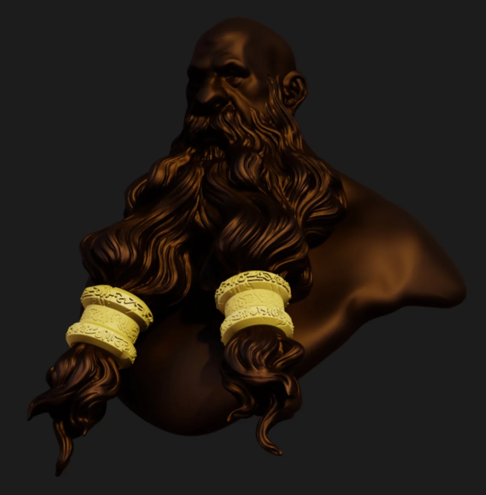 | 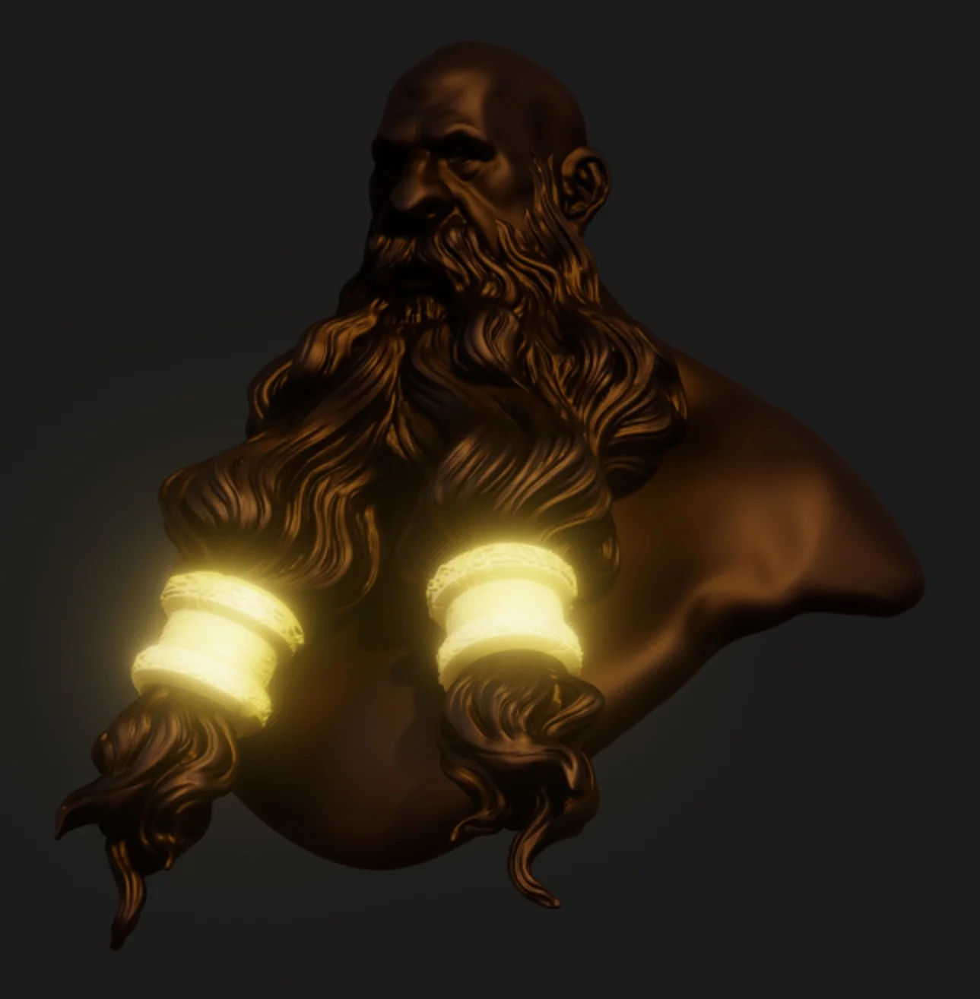 |  |

## Tone Mapping
Tone Mapping is an operation that will remap HDR values to the `[0, 1]` range.
If you don't use it (or select `none`), any color component higher than 1 will be clipped.
Any color variations above this range will then be lost.

* `None/Neutral/Agx/ACES` - which tonemapper to use. `None` does no remapping (but the other controls still work). The other options are similar to choosing different film stock, they will deal with overexposed values and colours in different ways. This is a very deep topic, lookup tone mapping, Agx, ACES for more info!
* `Exposure` - overall brightness of the images, similar to adjusting aperture on a camera. This can be a quick way to globally brighten or darken an image.
* `Saturation` - color strength. 1 is neutral, 0 is monochrome, values above 1 are increasingly saturated.
* `Contrast` - Make darks darker and lights lighter. Use carefully, it can introduce artifacts at high values.

Notice that with `Tone Mapping` disabled, some details disappear because the pixels are too bright.

| Tone Mapping off            | Tone Mapping on            |
| :-------------------------: | :------------------------: |
| 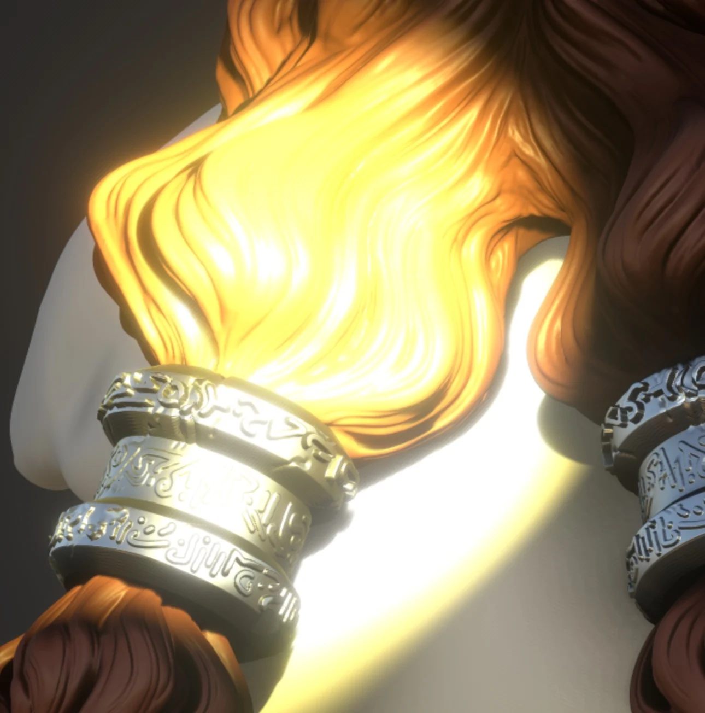 | 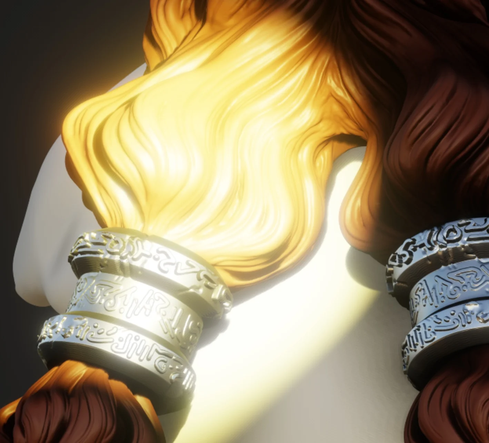 |

::: tip
Tone mapping can enhance the effect of global illumination. If you turn the instensity of the environment map down, the primary light source up, can increase the tone mapping `exposure` to see more of the bounce lighting effects.
:::

## Color Grading
Similar to the curves tool in Photoshop, this allows you to control the balance and distribution of color in the image. The `main` control affects the entire color balance, the `red`/`green`/`blue` controls allow for fine control. 

| Color Grading off             | Color Grading on             |
| :---------------------------: | :--------------------------: |
|  |  |

## Curvature
Detect where there are rapid changes in curvature, and apply a colour to those regions.

* `Factor` - overall intensity of the effect
* `Bump` - how much it will find sharp convex changes, and place the selected colour there (white by default)
* `Cavity` - how much it will detect concave changes, and place the selected colour there (black by default)

| Curvature off                    | Curvature on                   |
| :------------------------------: | :----------------------------: |
| 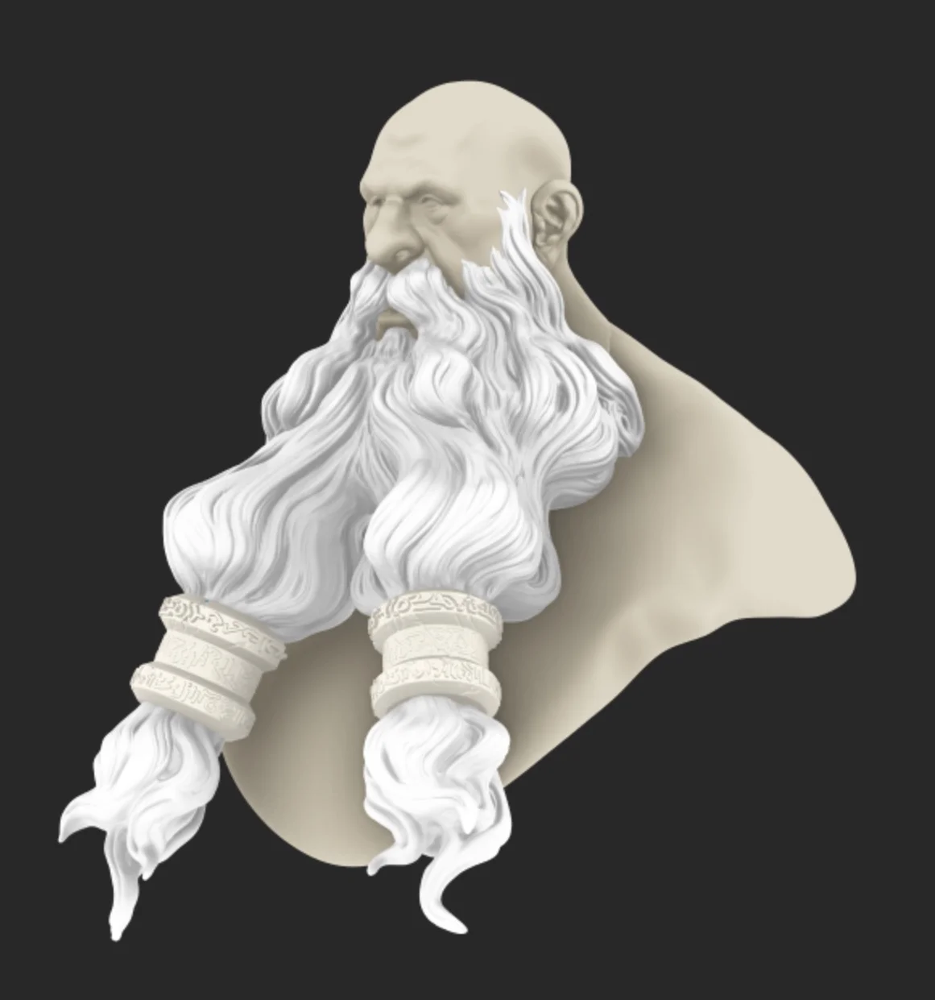 |  |

## Chromatic Aberration
Simulate the lens artifacts with light being decomposed around the screen edges.

* `Strength` - how much the red/green/blue parts of the image get split towards the screen edges

| Chromatic off                 | Chromatic on                 |
| :---------------------------: | :--------------------------: |
|  |  |

## Vignette
Simulate the lens artifacts by darkening the screen edges.

* `Size` - The size of a inverted ellipse placed over the image
* `Hardness` - How blurry or sharp the ellipse is mixed on top of the image.

| Vignette off                    | Vignette on                    |
| :-----------------------------: | :----------------------------: |
| 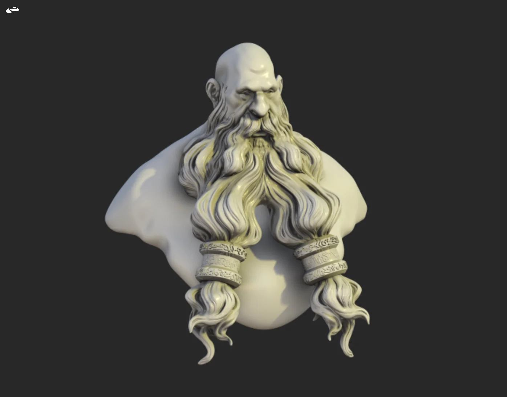 |  |

## Grain
Add a grain effect, it can help make the image a bit less artificial.

* `Strength` - the amount of grain/noise added to the image.

| Grain off                    | Grain on                   |
| :--------------------------: | :------------------------: |
|  |  |

## Sharpness
A sharpen effect similar to that in Photoshop or photo processing apps.

* `Strength` - the amount of sharpening applied to the image.

| Sharpness off                  | Sharpness on                 |
| :----------------------------: | :--------------------------: |
|  |  |

## Pixel Art
Simulate retro game pixel art.

* `Slider` - size of the pixels
* `Allow frame sampling` - if you get lots of black pixels, try turning this on, which will override the default sampling.

| Pixel off                   | Pixel on                   |
| :-------------------------: | :------------------------: |
|  |  |

## Scanline
Simulate the look of old CRT monitors.

* `Factor` - strength of the lines
* `Spacing` - size of the lines

| Scanline off                   | Scanline on                   |
| :----------------------------: | :---------------------------: |
|  |  |

## Dithering

Dither pixels to reduce banding artifacts. Usually this should be enabled, but can be turned off for specific operations (eg exporting depth maps or other data specific operations).